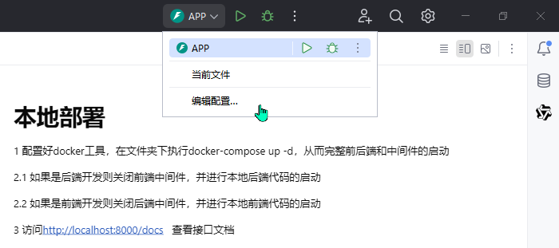
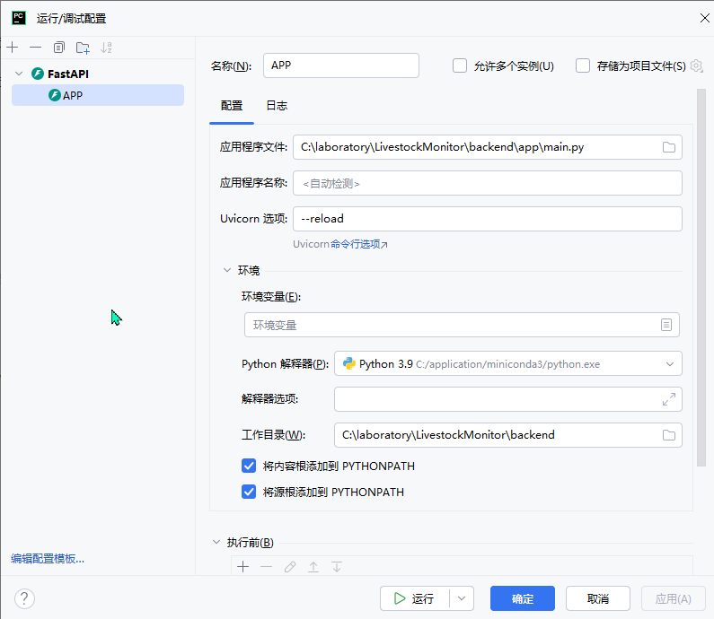

# 本地部署

1 配置好docker工具，在文件夹下执行docker compose up，从而完整前后端和中间件的启动

2.1 如果是要后端开发则关闭前端的docker容器，并进行本地后端代码的启动(具体细节在下面)

2.2 如果是要前端开发则关闭后端的docker容器，并进行本地前端代码的启动(具体细节在下面)

3 访问 http://localhost:8000/docs  查看接口文档

554894974


# 后端代码的启动

## 1 创建python==3.12的环境并且安装依赖

在conda环境里创建环境

```
conda create -n LivestockMonitor python=3.12
```

进入backend文件夹下

```
pip install -r requirements.txt
```

## 2 打开配置并修改配置






# 前端代码的启动(施工中、、、)