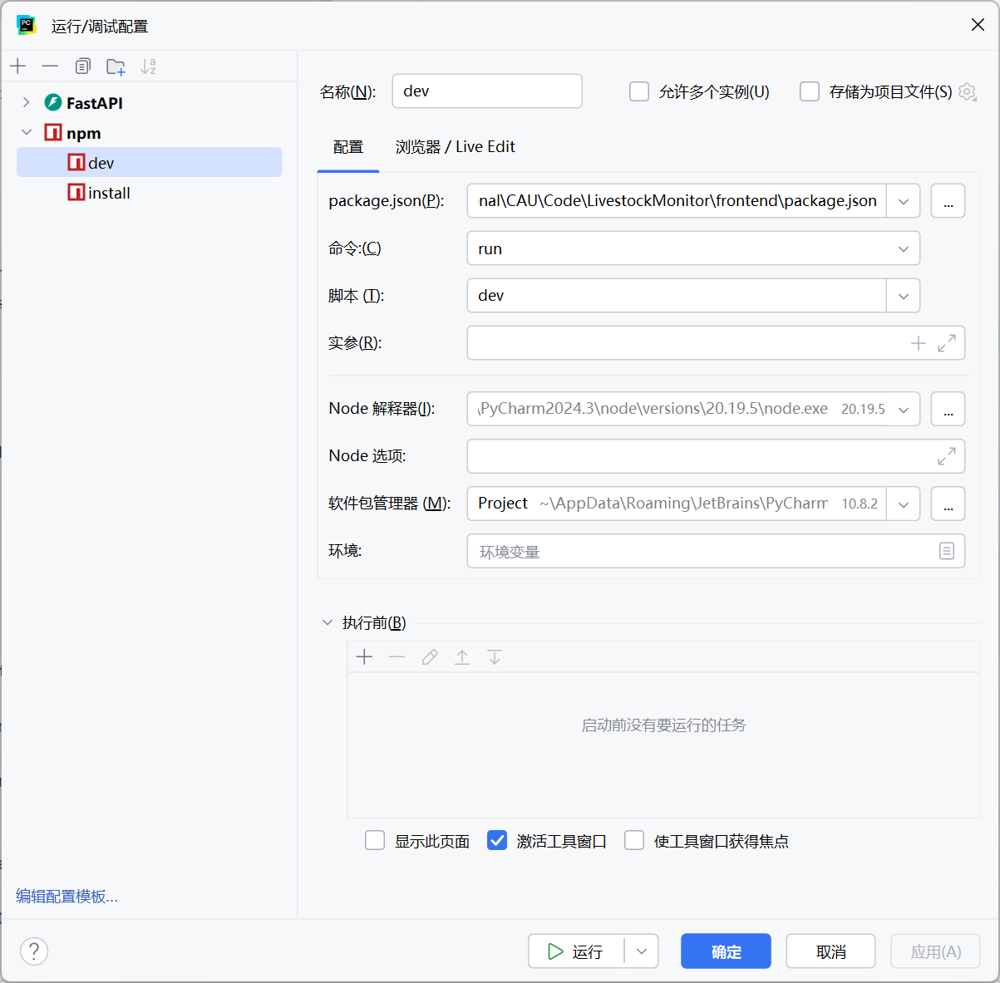

# 本地部署

1.1 配置好docker工具，复制一份根目录的.env.example文件重命名为.env文件，并根据需要修改配置(当前默认配置即可)

1.2 在文件夹下执行docker compose up，从而完成前后端和中间件的启动

2.1 如果是要后端开发则关闭前端的docker容器，并进行本地后端代码的启动(具体细节在下面)

2.2 如果是要前端开发则关闭后端的docker容器，并进行本地前端代码的启动(具体细节在下面)

3 访问 http://localhost:8000/docs  查看接口文档


# 后端代码的启动

## 1 创建python==3.12的环境并且安装依赖

在conda环境里创建环境

```
conda create -n LivestockMonitor python=3.12
```

进入backend文件夹下

```
pip install -r requirements.txt
```

## 2 打开并修改运行配置文件


# 前端代码的启动
## 1 安装nodejs环境
建议版本：v20.0.0 以上

## 2 进入frontend文件夹下安装依赖
```bash
cd frontend
npm install
```
## 3 打开并修改运行配置文件




分别运行install和dev